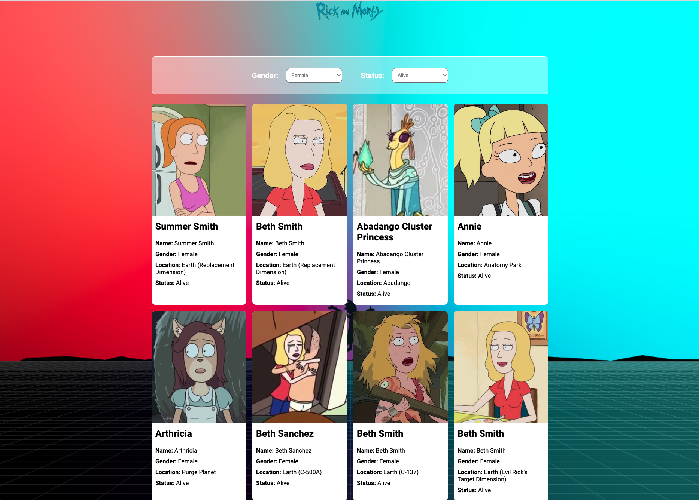
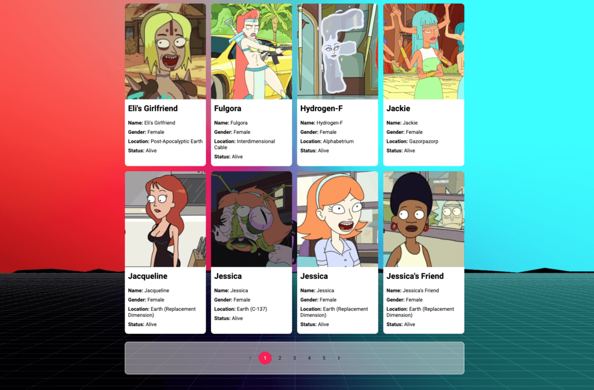

# Trendyol Front-End Bootcamp | Week-3 Homework Rick and Morty React App

## Content of Project

- A React App that gets data from public https://rickandmortyapi.com/ api. All characters listed when page is rendered. Users can filter characters through by gender and status.




To run the project:

First:

```bash
npm install
```
Then:

```bash
npm start
```
Project will run on [http://localhost:3000](http://localhost:3000).

To test the project:
```bash
npm test
```